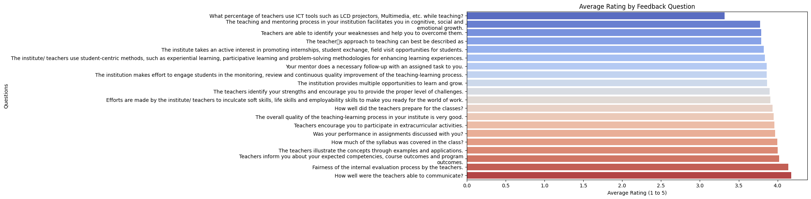

# 🧠 College Event Feedback Analysis – Google Colab

## 🚀 Internship Project – Task 3  
**Future Interns – Data Science & Analytics Internship**  
Created by: **Priyansh Golwalkar**  

---

## 🧾 About the Project

This project analyzes student feedback collected after campus events such as workshops, tech fests, and seminars. Using rating-based survey data, we uncover patterns of satisfaction, identify areas for improvement, and visualize trends for smarter event planning.

---

## 🛠 Tools & Skills Used

- **Google Colab** – Cloud-based notebook
- **pandas** – Data manipulation and cleaning  
- **matplotlib/seaborn** – For visualizing satisfaction trends  

---

## 📊 Analysis Performed

- 📌 Cleaned & reshaped raw feedback data  
- 📈 Created bar plots to show distribution of 1–5 ratings  
- 🧮 Calculated average rating per feedback question  
- 📉 Identified best and worst-performing questions  
- 📝 Recommendations for event organizers

---

## 📂 Dataset Used

> File: "Student_Satisfaction_Survey.csv"
Exported from a Google Form-based feedback system, with:
- Multiple feedback questions  
- Weightage columns (1–5 rating counts)  
- Course/Department-based grouping

---

## 📈 Key Visuals

- 📊 **Bar chart** showing rating spread
- 📉 **Horizontal bar chart** of average rating by question
- 🧾 CSV export of average ratings summary

---

## ✅ Insights & Recommendations

🔹 Most questions received strong 4–5 ratings, indicating general satisfaction.  
🔹 Few specific questions had 3.0 or below → need attention by event teams.  
🔹 Suggest conducting deeper follow-up for low-rated areas.

---

## 📷 Screenshot

---

## 🔗 Submission Details

> ✅ Internship Program: **Future Interns – Task 3**  
> 📅 Duration: June 2025  
> 👨‍💻 Platform: Google Colab

---

## 📬 Contact

Made with ❤️ **Priyansh Golwalkar**  
